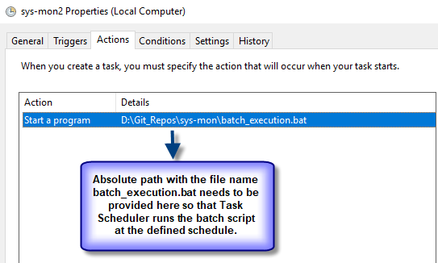
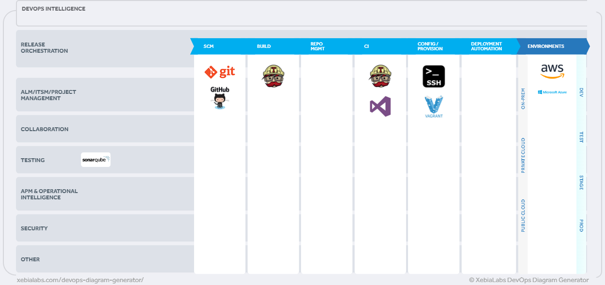

**Azure DevOps:** [](https://dev.azure.com/Tech-Overlord/sys-mon/_build/latest?definitionId=2)

**Travis-CI:** [](https://travis-ci.com/Tech-Overlord/sys-mon)   

**SonarCloud:** [](https://sonarcloud.io/dashboard?id=Tech-Overlord_sys-mon)  

**Core Infrastructure Initiatives:** [](https://bestpractices.coreinfrastructure.org/projects/2241)

**License:** [](https://github.com/Tech-Overlord/sys-mon/blob/master/LICENSE.md)  


# sys-mon:

Cross-platform scripts developed in Python3 for RAM monitoring and sending email alerts whenever the defined threshold has been exceeded on the system.

### Audience:
IT Professionals. Regardless of being a system administrator, developer or tester. **sys-mon** has been developed to be easily used by anyone.

### Key Features:
 1. Automatically identifies the Operating System type (i.e. Windows or Linux) at the start of it's execution each time.
 2. Consistent RAM utilization monitoring. 
    * Define a threshold limit, e.g. 70% .
    * Program will perform multiple actions when the RAM utilization exceeds the threshold.
 3. Report File generation.
    * Generates report in a .txt format. Obviously can change it to any other extension if need be, e.g ".log".
    * Report file will contain the exact time, date along with the defined threshold and the utilization identified when exceeded.
    * Will also print the Total, Used & Free RAM.
 4. Archiving Report file.
    * Report file will be deflated and archived for housekeeping purposes.
 5. Email alert to the owner with report archive as an attachment.
    * Use of python `smtplib` library to connect with Gmail's SMTP server and send an outgoing email to the owner which will also includes stats of overall RAM usage upon utilization exceeding the threshold.

### sys-mon's flowchart model:
*An easy to understand flowchart model of what sys-mon does!*


## 1. Getting Started

This sections covers the steps needed to get the utility in a running state on a system.

### 1.1. Tested on:
  * Windows Operating Systems (i.e. 7, 8, 8.x & 10). Works on Windows Server editions too.
  * Ubuntu 16.04 & Ubuntu 18.04


### 1.2. Pre-requisites:

#### 1.2.1. **Python3**
  * **Python 3** is easily available for free to download, install and use on windows & *nix platforms. If you do not have Python 3 installed on your machine where you require the use or execution of these scripts, please feel free to use the following methods:
        
  * **Windows**: [Python3.7.0](https://www.python.org/downloads/release/python-370/) is the latest major Python release that can easily be downloaded and installed. _Note:_ Python 3.7.0 was the major release at the point of this development. Feel free to use a newer 3.x Python version if you desire.
        
  * **Ubuntu LTS OS's**:  Pre-installed on Ubuntu LTS OS's i.e. 16.04 xenial & 18.04 bionic.

#### 1.2.2. **`psutil`** library

   * **Windows**: You can easily install psutil library using command prompt i.e. cmd. Just open cmd, and type in `pip install psutil` .
    
   * **Ubuntu LTS OS's**: Just run the [install_pre-reqs.bash](https://github.com/Tech-Overlord/sys-mon/blob/master/pre-reqs/install_pre-reqs.bash) script and it will take care of that for you.


### 1.3. Clone/Download `sysmon` release.

#### 1.3.1. Windows:
   * Either [Download](https://github.com/Tech-Overlord/sys-mon/releases/download/v1.0.0/system-info-1.0.1.zip) the latest release or clone the source code using `git clone https://github.com/Tech-Overlord/sys-mon`
   
#### 1.3.2. Ubuntu:
   * Change to user's home directory, for e.g. by entering the following command: `cd ~`
   * Either Download using `wget https://github.com/Tech-Overlord/sys-mon/releases/download/v1.0.0/system-info-1.0.0.tar.gz` or clone using `git clone https://github.com/Tech-Overlord/sys-mon`
       * If cloned, simply change into the root directory of the cloned project, for e.g. `cd ~/sys-mon/`
            * Do `chmod +x *`
       * If tar was downloaded using `wget`. Extract it using the commands: `tar -zxf sys-mon-1.0.0.tar.gz` and then cd into extracted directory, for e.g. if the extracted directory is sys-mon-1.0.0, then do `cd sys-mon-1.0.0/`
            * Do `chmod +x *`. This will ensure that the scripts have **execute** permissions.
            
## 2. Usage:

Utilizing & managing the utility is fairly easy. You will need to make a few changes to [varlist.py](https://github.com/Tech-Overlord/sys-mon/blob/master/monitor/varslist.py)  to ensure that the output is generated to desired directory in desired format & to [emailvarslist.py](https://github.com/Tech-Overlord/sys-mon/blob/master/alerts/emailvarslist.py) for ensuring that authentication with gmail's SMTP for alerting purpose (if enabled).

### 2.1. Changes to varslist.py
This file is located on the root of **monitor** package (hierarchy is: sys-mon/monitor/varslist.py). It basically contains all the variables and their corresponding values that are used/inherited throughout the modules which reside within the **monitor** package. Variables and values were stored into this particular file for the purpose of "ease of use", which means that the user can simply change the corresponding variable's value without having to go through the whole code.

Since the utility automatically identifies which system it is running on at each execution, you will only need to change the variables linked to your own OS type. These are categorized below:

#### 2.1.1. Windows OS variables list & description
As mentioned above, these are variables that are only related to Windows Operating systems.

|          Variable           |                  Description                |              Example              |
|        :-------------        |                  :-------------            |               :-----             |
|**win_dir**| Variable for the directory on a Windows system, where you want the report file to be generated. If the folder does not exist, it will automatically be created at the time of script's first execution. |Assuming you need the report file to be generated on the root of a folder called **Monitoring_Reports** on the system's D: drive, change value from `win_dir = "D:\\example\\"` to `win_dir = "D:\\Monitory_Reports\\"`. Please **NOTE** that the double backslashes are compulsory for Windows oriented paths in Python. |

#### 2.1.2. Linux OS variables list & description
As mentioned above, these are variables that are only related to Linux Operating systems.

|          Variable           |                  Description                |              Example              |
|        :-------------        |                  :-------------            |               :-----             |
|**nix_dir**| Variable for the directory on a Linux system, where you want the report file to be generated. If the folder does not exist already, it will automatically be created at the time of script's first execution. |Assuming you need the report file to be generated on the root of a folder called **Monitoring_Reports** on the system's /tmp folder, change value from `win_dir = "/tmp/"` to `win_dir = "/tmp/Monitory_Reports/"`. Please **NOTE** that the double backslashes are **NOT** required for Linux oriented paths in Python, they can be added as they are. |

#### 2.1.3. General variables list & description
As mentioned above, these are variables that are used for general purposes. Description has been provided in case that they may need to be changed (if the user desires to).

|          Variable           |                  Description                |              Example              |
|        :-------------        |                  :-------------            |               :-----             |
|**data_measure**| It is the variable which holds the value for the data measurement type. By default, code has it set to GigaByte. Due to common uses, only GigaBytes, MegaBytes and KiloBytes are supported in this utility for now. | If for example, you need to change the data measurement from **gigabyte** to **megabyte** for representation of data measurement type, change the variable's value from `data_measure = gigabyte` to `data_measure = megabyte`. This will  automatically return the output in MegaBytes format and you won't need to make any other changes anywhere else in the code. |
|**threshold**| The value against this variable will be the **threshold limit** in terms of the total usage of RAM in Percentage format. | If for example, you need to set the threshold limit to 60, which basically means that once the **limit of RAM usage reaches to 60%**, notify the user immediately; then you can change value from `threshold = float(50)` to `threshold = float(60)`|

### 2.2. Changes to emailsvarslist.py
This file is located on the root of **alerts** package (hierarchy is: sys-mon/alerts/emailvarslist.py). It basically contains all the variables and their corresponding values that are used/inherited throughout the **email** modules which reside within the **email** package. Variables and values were stored into this particular file for the purpose of "ease of use", which means that the user can simply change the corresponding variable's value without having to go through the whole code.

**PLEASE NOTE** that the current email support is with gmail (Google Mail) only. Connection is secure over SSL (**Secure Socket Layer**). You will need to set Allow less secure apps: OFF to Allowed on https://myaccount.google.com/lesssecureapps?pli=1 for sys-mon utility to connect with gmail and send emails. If you do not need the email functionality enabled. Simply comment the following two lines of code from `sysmonitoring.py` (resides on the root of **sys-mon**).

Disabling email functionality (sysmonitoring.py)

From:
```python
import alerts.sendemail as se
se
```

TO:
```python
# import alerts.sendemail as se
# se
```
By default, the package has those two lines of code set as a comment so that you can easily run & test sys-mon without email functionality since the execution will fail if the google mail's authentication for sender's email and password are incorrect.

Below table consists a list of variables that need to be provided with appropriate values for the email functionality to work.

|          Variable           |                  Description                |              Example              |
|        :-------------       |                  :-------------             |               :-----              |
|**sender_email**| Variable that will contain the email address of the sender. | Assuming that your email address is **myemail@gmail.com**, change from `sender_email = str('sender0@gmail.com')` to `sender_email = str('myemail@gmail.com')`. **DO NOT REMOVE** the single quotes within the string value('  '). |
|**sender_password**| Variable that contains the password to the sender's email address above. | Assuming that the password to your email address is **iampassword**, change from `sender_password = str('password')` to `sender_password = str('iampassword')`. **DO NOT REMOVE** the single quotes within the string value('  '). |
|**receiver_email**| Variable that will contain the email address of the receiver. | Assuming that your email address is **myemail@gmail.com**, change from `sender_email = str('sender0@gmail.com')` to `sender_email = str('myemail@gmail.com')`. **DO NOT REMOVE** the single quotes within the string value('  '). |

### 2.3. Execution.

Section below describes the execution process for both Windows & Linux systems.

#### 2.3.1 Windows
1. Perform cd into the directory where the extracted archive or project is cloned in. For instance, if you have extracted or cloned into D:\ drive. Do `cd D:\sys-mon`. Current directory should be: D:\sys-mon\
2. Execute sysmonitoring.py with the following commands: `python main_system.py`
3. All done. That should print an output like below:
```cmd
D:\sys-mon>python sysmonitoring.py
System is Windows.
RAM usage has exceeded the specified threshold, which is: 50.0%
Current RAM usage is: 76.9%
Directory where reports are generated already exists. No new directory will be created.
Report Generation directory path is: D:\Monitory_Reports\
Generated Report file is: report_26092018-102010.txt
Current directory is: D:\Monitory_Reports
```

#### 2.3.1 Linux
1. If the code was cloned, then simply cd into the directory with `cd ~\sys-mon`. If it was downloaded using wget and tar has been extracted already as mentioned in steps from section **1.3.2**, then change to it's directory, e.g. `cd ~/sys-mon-1.0.0/`
2. Assuming the scripts have been provided with executable permissions using `chmod +x *`, we ca now perform a straight execution using `python3 sysmonitoring.py`. Output will be something like the following:
```bash
tech-overlord@ubuntu:~/sys-mon$ python3 sysmonitoring.py
System is Linux.
RAM usage has exceeded the specified threshold, which is: 50.0%
Current RAM usage is: 69.2%
Directory where reports are generated does not exist and will now be created.
Report Generation directory has been created on: /tmp/MonitoringReports/
Generated Report file is: report_25092018-222809.txt
Current directory is: /tmp/MonitoringReports
```

## 3. Scheduling:
It's best to schedule the utility to run. It is your choice to set up the schedule according to your needs, whether it be at system boot or at a specific time or perhaps even after particular intervals. Simply your choice, so decide what meets your business needs the best.

Windows and Linux both have their own scheduling mechanisms so I would recommend using the most basic ways of scheduling tasks to run on either systems.

### 3.1 Windows
Easiest way to schedule would be using task scheduler. You can google how to set up a task on task scheduler or use this [link](https://www.digitalcitizen.life/how-create-task-basic-task-wizard) for reference. You will need to set the action item as the batch script that is provided and should be on the root of sys-mon called [batch_exeuction](https://github.com/Tech-Overlord/sys-mon/blob/master/batch_execution.bat). Simply modify the batch file for the absolute paths that are mentioned within the batch script. 

Example of what the action item may look like:



### 3.2 Linux
Set a cron-job on Linux to have `sysmonitoring.py` execute automatically at whatever schedule you desire. For reference, have a look at this [link](http://www.unixgeeks.org/security/newbie/unix/cron-1.html) if you need to find out how to set up cronjobs.


## 4. Build/Deployments:
This project has been built by integrating and using both [TravisCI](https://travis-ci.com/Tech-Overlord/sys-mon) & [Azure DevOps](https://dev.azure.com/Tech-Overlord/sys-mon/sys-mon%20Team/_dashboards/sys-mon%20Team/aec4f0d8-16f8-4880-ac8e-1dd8e3ab5314) onto Linux (Ubuntu 1604 LTS) & Windows Instances generated on AWS & Azure.

Code analysis has been done using integration with [SonarCloud](https://sonarcloud.io/dashboard?id=Tech-Overlord_sys-mon).

Below is a DevOps diagram of this project as it stands now:



## 5. Authors
[Ali Muhammad](https://www.linkedin.com/in/ali-muhammad-759791130/)


## 6. License
Please see [License](https://github.com/Tech-Overlord/sys-mon/blob/master/LICENSE.md) for use or feel free to ask.


## 7. Acknowledgments
[Giampaolo Rodola](https://github.com/giampaolo) for his brilliant development of [psutil](https://github.com/giampaolo/psutil) package.