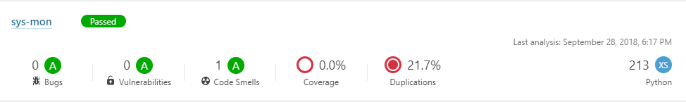

[](https://sourcerer.io/fame/Tech-Overlord/Tech-Overlord/sys-mon/links/0)[](https://sourcerer.io/fame/Tech-Overlord/Tech-Overlord/sys-mon/links/1)[](https://sourcerer.io/fame/Tech-Overlord/Tech-Overlord/sys-mon/links/2)[](https://sourcerer.io/fame/Tech-Overlord/Tech-Overlord/sys-mon/links/3)[](https://sourcerer.io/fame/Tech-Overlord/Tech-Overlord/sys-mon/links/4)[](https://sourcerer.io/fame/Tech-Overlord/Tech-Overlord/sys-mon/links/5)[](https://sourcerer.io/fame/Tech-Overlord/Tech-Overlord/sys-mon/links/6)[](https://sourcerer.io/fame/Tech-Overlord/Tech-Overlord/sys-mon/links/7)


**Azure DevOps:** [](https://dev.azure.com/Tech-Overlord/sys-mon/_build/latest?definitionId=2)

**Travis-CI:** [](https://travis-ci.com/Tech-Overlord/sys-mon)   

**SonarCloud:** [](https://sonarcloud.io/dashboard?id=Tech-Overlord_sys-mon)  

**Core Infrastructure Initiatives:** [](https://bestpractices.coreinfrastructure.org/projects/2241)

**License:** [](https://github.com/Tech-Overlord/sys-mon/blob/master/LICENSE.md)  


# sys-mon:

Cross-platform scripts developed in Python3 for RAM monitoring and sending email alerts whenever the defined threshold has been exceeded on the system.

### Audience:
IT Professionals. Regardless of being a system administrator, developer or tester. **sys-mon** has been developed to be easily used by anyone.

### Key Features:
 1. Automatically identifies the Operating System type (i.e. Windows or Linux) at the start of it's execution each time.
 2. Consistent RAM utilization monitoring. 
    * Define a threshold limit, e.g. 70% .
    * Program will perform multiple actions when the RAM utilization exceeds the threshold.
 3. Report File generation.
    * Generates report in a .txt format. Obviously can change it to any other extension if need be, e.g ".log".
    * Report file will contain the exact time, date along with the defined threshold and the utilization identified when exceeded.
    * Will also print the Total, Used & Free RAM.
 4. Archiving Report file.
    * Report file will be deflated and archived for housekeeping purposes.
 5. Email alert to the owner with report archive as an attachment.
    * Use of python `smtplib` library to connect with Gmail's SMTP server and send an outgoing email to the owner which will also includes stats of overall RAM usage upon utilization exceeding the threshold.

### sys-mon's flowchart model:
*An easy to understand flowchart model of what sys-mon does!*


## 1. Getting Started

This sections covers the steps needed to get the utility in a running state on a system.

### 1.1. Tested on:
  * Windows Operating Systems (i.e. 7, 8, 8.x & 10). Works on Windows Server editions too.
  * Ubuntu 16.04 & Ubuntu 18.04


### 1.2. Pre-requisites:

#### 1.2.1. **Python3**
  * **Python 3** is easily available for free to download, install and use on windows & *nix platforms. If you do not have Python 3 installed on your machine where you require the use or execution of these scripts, please feel free to use the following methods:
        
  * **Windows**: [Python3.7.0](https://www.python.org/downloads/release/python-370/) is the latest major Python release that can easily be downloaded and installed. _Note:_ Python 3.7.0 was the major release at the point of this development. Feel free to use a newer 3.x Python version if you desire.
        
  * **Ubuntu LTS OS's**:  Pre-installed on Ubuntu LTS OS's i.e. 16.04 xenial & 18.04 bionic.

#### 1.2.2. **`psutil`** library

   * **Windows**: You can easily install psutil library using command prompt i.e. cmd. Just open cmd, and type in `pip install psutil` .
    
   * **Ubuntu LTS OS's**: Just run the [install_pre-reqs.bash](https://github.com/Tech-Overlord/sys-mon/blob/master/pre-reqs/install_pre-reqs.bash) script and it will take care of that for you.


### 1.3. Clone/Download `sysmon` release.

#### 1.3.1. Windows:
   * Either [Download](https://github.com/Tech-Overlord/sys-mon/releases/download/v1.0.0/sys-mon-1.0.0.zip) the latest release or clone the source code using `git clone https://github.com/Tech-Overlord/sys-mon`
   
#### 1.3.2. Ubuntu:
   * Change to user's home directory, for e.g. by entering the following command: `cd ~`
   * Either Download using `wget https://github.com/Tech-Overlord/sys-mon/releases/download/v1.0.0/sys-mon-1.0.0.tar.gz` or clone using `git clone https://github.com/Tech-Overlord/sys-mon`
       * If cloned, simply change into the root directory of the cloned project, for e.g. `cd ~/sys-mon/`
            * Do `chmod +x *`
       * If tar was downloaded using `wget`. Extract it using the commands: `tar -zxf sys-mon-1.0.0.tar.gz` and then cd into extracted directory, for e.g. if the extracted directory is sys-mon-1.0.0, then do `cd sys-mon-1.0.0/`
            * Do `chmod +x *`. This will ensure that the scripts have **execute** permissions.
            
## 2. Usage:

Utilizing & managing the utility is fairly easy. You will need to make a few changes to [varlist.py](https://github.com/Tech-Overlord/sys-mon/blob/master/monitor/varslist.py)  to ensure that the output is generated to desired directory in desired format & to [emailvarslist.py](https://github.com/Tech-Overlord/sys-mon/blob/master/alerts/emailvarslist.py) for ensuring that authentication with gmail's SMTP for alerting purpose (if enabled).

### 2.1. Changes to varslist.py
This file is located on the root of **monitor** package (hierarchy is: sys-mon/monitor/varslist.py). It basically contains all the variables and their corresponding values that are used/inherited throughout the modules which reside within the **monitor** package. Variables and values were stored into this particular file for the purpose of "ease of use", which means that the user can simply change the corresponding variable's value without having to go through the whole code.

Since the utility automatically identifies which system it is running on at each execution, you will only need to change the variables linked to your own OS type. These are categorized below:

#### 2.1.1. Windows OS variables list & description
As mentioned above, these are variables that are only related to Windows Operating systems.

|          Variable           |                  Description                |              Example              |
|        :-------------        |                  :-------------            |               :-----             |
|**win_dir**| Variable for the directory on a Windows system, where you want the report file to be generated. If the folder does not exist, it will automatically be created at the time of script's first execution. |Assuming you need the report file to be generated on the root of a folder called **Monitoring_Reports** on the system's D: drive, change value from `win_dir = "D:\\example\\"` to `win_dir = "D:\\Monitory_Reports\\"`. Please **NOTE** that the double backslashes are compulsory for Windows oriented paths in Python. |

#### 2.1.2. Linux OS variables list & description
As mentioned above, these are variables that are only related to Linux Operating systems.

|          Variable           |                  Description                |              Example              |
|        :-------------        |                  :-------------            |               :-----             |
|**nix_dir**| Variable for the directory on a Linux system, where you want the report file to be generated. If the folder does not exist already, it will automatically be created at the time of script's first execution. |Assuming you need the report file to be generated on the root of a folder called **Monitoring_Reports** on the system's /tmp folder, change value from `win_dir = "/tmp/"` to `win_dir = "/tmp/Monitory_Reports/"`. Please **NOTE** that the double backslashes are **NOT** required for Linux oriented paths in Python, they can be added as they are. |

#### 2.1.3. General variables list & description
As mentioned above, these are variables that are used for general purposes. Description has been provided in case that they may need to be changed (if the user desires to).

|          Variable           |                  Description                |              Example              |
|        :-------------        |                  :-------------            |               :-----             |
|**data_measure**| It is the variable which holds the value for the data measurement type. By default, code has it set to GigaByte. Due to common uses, only GigaBytes, MegaBytes and KiloBytes are supported in this utility for now. | If for example, you need to change the data measurement from **gigabyte** to **megabyte** for representation of data measurement type, change the variable's value from `data_measure = gigabyte` to `data_measure = megabyte`. This will  automatically return the output in MegaBytes format and you won't need to make any other changes anywhere else in the code. |
|**threshold**| The value against this variable will be the **threshold limit** in terms of the total usage of RAM in Percentage format. | If for example, you need to set the threshold limit to 60, which basically means that once the **limit of RAM usage reaches to 60%**, notify the user immediately; then you can change value from `threshold = float(50)` to `threshold = float(60)`|

### 2.2. Changes to emailsvarslist.py
This file is located on the root of **alerts** package (hierarchy is: sys-mon/alerts/emailvarslist.py). It basically contains all the variables and their corresponding values that are used/inherited throughout the **email** modules which reside within the **email** package. Variables and values were stored into this particular file for the purpose of "ease of use", which means that the user can simply change the corresponding variable's value without having to go through the whole code.

**PLEASE NOTE** that the current email support is with gmail (Google Mail) only. Connection is secure over SSL (**Secure Socket Layer**). You will need to set Allow less secure apps: OFF to Allowed on https://myaccount.google.com/lesssecureapps?pli=1 for sys-mon utility to connect with gmail and send emails. If you do not need the email functionality enabled. Simply comment the following two lines of code from `sysmonitoring.py` (resides on the root of **sys-mon**).

Disabling email functionality (sysmonitoring.py)

From:
```python
import alerts.sendemail as se
se
```

TO:
```python
# import alerts.sendemail as se
# se
```
By default, the package has those two lines of code set as a comment so that you can easily run & test sys-mon without email functionality since the execution will fail if the google mail's authentication for sender's email and password are incorrect.

Below table consists a list of variables that need to be provided with appropriate values for the email functionality to work.

|          Variable           |                  Description                |              Example              |
|        :-------------       |                  :-------------             |               :-----              |
|**sender_email**| Variable that will contain the email address of the sender. | Assuming that your email address is **myemail@gmail.com**, change from `sender_email = str('sender0@gmail.com')` to `sender_email = str('myemail@gmail.com')`. **DO NOT REMOVE** the single quotes within the string value('  '). |
|**sender_password**| Variable that contains the password to the sender's email address above. | Assuming that the password to your email address is **iampassword**, change from `sender_password = str('password')` to `sender_password = str('iampassword')`. **DO NOT REMOVE** the single quotes within the string value('  '). |
|**receiver_email**| Variable that will contain the email address of the receiver. | Assuming that your email address is **myemail@gmail.com**, change from `sender_email = str('sender0@gmail.com')` to `sender_email = str('myemail@gmail.com')`. **DO NOT REMOVE** the single quotes within the string value('  '). |

### 2.3. Execution.

Section below describes the execution process for both Windows & Linux systems.

#### 2.3.1 Windows
1. Perform cd into the directory where the extracted archive or project is cloned in. For instance, if you have extracted or cloned into D:\ drive. Do `cd D:\sys-mon`. Current directory should be: D:\sys-mon\
2. Execute sysmonitoring.py with the following commands: `python main_system.py`
3. All done. That should print an output like below:
```cmd
D:\sys-mon>python sysmonitoring.py
System is Windows.
RAM usage has exceeded the specified threshold, which is: 50.0%
Current RAM usage is: 76.9%
Directory where reports are generated already exists. No new directory will be created.
Report Generation directory path is: D:\Monitory_Reports\
Generated Report file is: report_26092018-102010.txt
Current directory is: D:\Monitory_Reports
```

#### 2.3.1 Linux
1. If the code was cloned, then simply cd into the directory with `cd ~\sys-mon`. If it was downloaded using wget and tar has been extracted already as mentioned in steps from section **1.3.2**, then change to it's directory, e.g. `cd ~/sys-mon-1.0.0/`
2. Assuming the scripts have been provided with executable permissions using `chmod +x *`, we ca now perform a straight execution using `python3 sysmonitoring.py`. Output will be something like the following:
```bash
tech-overlord@ubuntu:~/sys-mon$ python3 sysmonitoring.py
System is Linux.
RAM usage has exceeded the specified threshold, which is: 50.0%
Current RAM usage is: 69.2%
Directory where reports are generated does not exist and will now be created.
Report Generation directory has been created on: /tmp/MonitoringReports/
Generated Report file is: report_25092018-222809.txt
Current directory is: /tmp/MonitoringReports
```

## 3. Scheduling:
It's best to schedule the utility to run. It is your choice to set up the schedule according to your needs, whether it be at system boot or at a specific time or perhaps even after particular intervals. Simply your choice, so decide what meets your business needs the best.

Windows and Linux both have their own scheduling mechanisms so I would recommend using the most basic ways of scheduling tasks to run on either systems.

### 3.1 Windows
Easiest way to schedule would be using task scheduler. You can google how to set up a task on task scheduler or use this [link](https://www.digitalcitizen.life/how-create-task-basic-task-wizard) for reference. You will need to set the action item as the batch script that is provided and should be on the root of sys-mon called [batch_exeuction](https://github.com/Tech-Overlord/sys-mon/blob/master/batch_execution.bat). Simply modify the batch file for the absolute paths that are mentioned within the batch script. 

Example of what the action item may look like:


### 3.2 Linux
Set a cron-job on Linux to have `sysmonitoring.py` execute automatically at whatever schedule you desire. For reference, have a look at this [link](http://www.unixgeeks.org/security/newbie/unix/cron-1.html) if you need to find out how to set up cronjobs.


## 4. Build/Deployments:
This project has been built by integrating and using both [TravisCI](https://travis-ci.com/Tech-Overlord/sys-mon) & [Azure DevOps](https://dev.azure.com/Tech-Overlord/sys-mon/sys-mon%20Team/_dashboards/sys-mon%20Team/aec4f0d8-16f8-4880-ac8e-1dd8e3ab5314) onto Linux (Ubuntu 1604 LTS) & Windows Instances generated on AWS & Azure.

Code analysis has been done using integration with [SonarCloud](https://sonarcloud.io/dashboard?id=Tech-Overlord_sys-mon).

Below is a DevOps diagram of this project as it stands now:


## 5. Statistics

#### 5.1 Execution time statistics:

To analyze the time duration of sys-mon's execution, 4 loops took place with 5 repetitions in each loop. Best execution time recorded was 80 nano-seconds.
```cmd
D:\sys-mon>python -m timeit -n 4 -r 5 -s "import sysmonitoring"
4 loops, best of 5: 80 nsec per loop
```
Thus ensuring that the utility's performance in terms of speed is high.

#### 5.2 Functional statistics:
Following is the amount of time spent on each function and method, as well as, the number of times each of them has been called.
```cmd
D:\sys-mon>python -m cProfile -s cumulative sysmonitoring.py

         26860 function calls (26098 primitive calls) in 0.239 seconds

   Ordered by: cumulative time

   ncalls  tottime  percall  cumtime  percall filename:lineno(function)
     69/1    0.003    0.000    0.239    0.239 {built-in method builtins.exec}
        1    0.000    0.000    0.239    0.239 sysmonitoring.py:4(<module>)
     48/3    0.000    0.000    0.217    0.072 <frozen importlib._bootstrap>:978(_find_and_load)
     48/3    0.000    0.000    0.217    0.072 <frozen importlib._bootstrap>:948(_find_and_load_unlocked)
     45/4    0.000    0.000    0.216    0.054 <frozen importlib._bootstrap>:663(_load_unlocked)
     33/4    0.000    0.000    0.216    0.054 <frozen importlib._bootstrap_external>:722(exec_module)
     61/4    0.000    0.000    0.204    0.051 <frozen importlib._bootstrap>:211(_call_with_frames_removed)
        1    0.000    0.000    0.203    0.203 ramchecker.py:3(<module>)
       33    0.001    0.000    0.178    0.005 <frozen importlib._bootstrap_external>:793(get_code)
       33    0.002    0.000    0.171    0.005 <frozen importlib._bootstrap_external>:914(get_data)
       33    0.169    0.005    0.169    0.005 {method 'read' of '_io.FileIO' objects}
        1    0.000    0.000    0.158    0.158 varslist.py:3(<module>)
        1    0.000    0.000    0.129    0.129 __init__.py:21(<module>)
      5/4    0.000    0.000    0.046    0.012 {built-in method builtins.__import__}
   134/93    0.000    0.000    0.045    0.000 <frozen importlib._bootstrap>:1009(_handle_fromlist)
        1    0.000    0.000    0.029    0.029 filegenerator.py:3(<module>)
        1    0.000    0.000    0.027    0.027 _compat.py:5(<module>)
        1    0.000    0.000    0.026    0.026 subprocess.py:42(<module>)
        1    0.000    0.000    0.026    0.026 shutil.py:5(<module>)
        1    0.004    0.004    0.023    0.023 ramchecker.py:8(ram_check)
        1    0.000    0.000    0.017    0.017 threading.py:1(<module>)
        1    0.000    0.000    0.016    0.016 archiver.py:3(<module>)
        1    0.000    0.000    0.016    0.016 _common.py:5(<module>)
        1    0.000    0.000    0.016    0.016 archiver.py:8(win_archive_report)
       48    0.000    0.000    0.012    0.000 <frozen importlib._bootstrap>:882(_find_spec)
        1    0.000    0.000    0.012    0.012 bz2.py:5(<module>)
        3    0.011    0.004    0.012    0.004 {built-in method io.open}
       41    0.000    0.000    0.012    0.000 <frozen importlib._bootstrap_external>:1272(find_spec)
       41    0.000    0.000    0.012    0.000 <frozen importlib._bootstrap_external>:1240(_get_spec)
      132    0.001    0.000    0.011    0.000 <frozen importlib._bootstrap_external>:1356(find_spec)
        1    0.000    0.000    0.010    0.010 zipfile.py:1150(__init__)
        1    0.000    0.000    0.010    0.010 traceback.py:1(<module>)
        1    0.000    0.000    0.008    0.008 linecache.py:6(<module>)
      210    0.000    0.000    0.008    0.000 <frozen importlib._bootstrap_external>:74(_path_stat)
      212    0.008    0.000    0.008    0.000 {built-in method nt.stat}
       45    0.000    0.000    0.007    0.000 <frozen importlib._bootstrap>:576(module_from_spec)
        1    0.000    0.000    0.006    0.006 socket.py:47(<module>)
        5    0.000    0.000    0.005    0.001 <frozen importlib._bootstrap_external>:1040(create_module)
        5    0.005    0.001    0.005    0.001 {built-in method _imp.create_dynamic}
       11    0.000    0.000    0.005    0.000 re.py:232(compile)
       11    0.000    0.000    0.005    0.000 re.py:271(_compile)
       11    0.000    0.000    0.005    0.000 sre_compile.py:759(compile)
       33    0.000    0.000    0.005    0.000 <frozen importlib._bootstrap_external>:523(_compile_bytecode)
        1    0.000    0.000    0.005    0.005 platform.py:10(<module>)
        2    0.000    0.000    0.005    0.002 zipfile.py:1769(close)
        1    0.000    0.000    0.004    0.004 _pswindows.py:5(<module>)
        1    0.000    0.000    0.004    0.004 zipfile.py:1892(_fpclose)
        1    0.004    0.004    0.004    0.004 {method 'close' of '_io.BufferedRandom' objects}
       33    0.004    0.000    0.004    0.000 {built-in method marshal.loads}
       35    0.001    0.000    0.004    0.000 __init__.py:316(namedtuple)
       11    0.000    0.000    0.003    0.000 sre_parse.py:919(parse)
    54/11    0.000    0.000    0.003    0.000 sre_parse.py:417(_parse_sub)
    58/13    0.001    0.000    0.003    0.000 sre_parse.py:475(_parse)
        1    0.000    0.000    0.003    0.003 tokenize.py:21(<module>)
       45    0.000    0.000    0.002    0.000 <frozen importlib._bootstrap_external>:84(_path_is_mode_type)
       79    0.001    0.000    0.002    0.000 {built-in method builtins.__build_class__}
       42    0.000    0.000    0.002    0.000 <frozen importlib._bootstrap_external>:93(_path_isfile)
        1    0.000    0.000    0.002    0.002 filegenerator.py:39(win_folder)
        6    0.000    0.000    0.002    0.000 enum.py:624(_convert)
       11    0.000    0.000    0.002    0.000 sre_compile.py:598(_code)
        1    0.000    0.000    0.002    0.002 selectors.py:5(<module>)
       29    0.000    0.000    0.001    0.000 enum.py:281(__call__)
   117/11    0.001    0.000    0.001    0.000 sre_compile.py:71(_compile)
        7    0.000    0.000    0.001    0.000 enum.py:386(_create_)
      646    0.001    0.000    0.001    0.000 <frozen importlib._bootstrap_external>:56(_path_join)
       33    0.000    0.000    0.001    0.000 <frozen importlib._bootstrap_external>:951(path_stats)
       10    0.000    0.000    0.001    0.000 enum.py:134(__new__)
        1    0.000    0.000    0.001    0.001 zipfile.py:5(<module>)
       45    0.000    0.000    0.001    0.000 <frozen importlib._bootstrap>:504(_init_module_attrs)
        1    0.000    0.000    0.001    0.001 lzma.py:9(<module>)
        1    0.000    0.000    0.001    0.001 fnmatch.py:11(<module>)
       48    0.000    0.000    0.001    0.000 <frozen importlib._bootstrap>:147(__enter__)
        7    0.001    0.000    0.001    0.000 {built-in method builtins.print}
        1    0.000    0.000    0.001    0.001 datetime.py:5(<module>)
       66    0.000    0.000    0.001    0.000 <frozen importlib._bootstrap_external>:271(cache_from_source)
       71    0.000    0.000    0.001    0.000 <frozen importlib._bootstrap>:403(cached)
       55    0.000    0.000    0.001    0.000 <frozen importlib._bootstrap>:157(_get_module_lock)
      646    0.000    0.000    0.001    0.000 <frozen importlib._bootstrap_external>:58(<listcomp>)
       38    0.000    0.000    0.001    0.000 <frozen importlib._bootstrap_external>:369(_get_cached)
        1    0.000    0.000    0.001    0.001 zipfile.py:1676(write)
        1    0.000    0.000    0.001    0.001 signal.py:1(<module>)
      884    0.000    0.000    0.001    0.000 sre_parse.py:164(__getitem__)
        6    0.000    0.000    0.001    0.000 enum.py:645(<listcomp>)
      101    0.001    0.000    0.001    0.000 {built-in method __new__ of type object at 0x5736E278}
      161    0.000    0.000    0.001    0.000 <frozen importlib._bootstrap_external>:1203(_path_importer_cache)
        1    0.000    0.000    0.001    0.001 __init__.py:71(search_function)
        7    0.000    0.000    0.000    0.000 <frozen importlib._bootstrap>:740(create_module)
        7    0.000    0.000    0.000    0.000 {built-in method _imp.create_builtin}
   150/44    0.000    0.000    0.000    0.000 sre_parse.py:174(getwidth)
      429    0.000    0.000    0.000    0.000 sre_parse.py:254(get)
      751    0.000    0.000    0.000    0.000 {built-in method builtins.getattr}
       38    0.000    0.000    0.000    0.000 <frozen importlib._bootstrap_external>:1351(_get_spec)
       33    0.000    0.000    0.000    0.000 <frozen importlib._bootstrap_external>:438(_classify_pyc)
        3    0.000    0.000    0.000    0.000 <frozen importlib._bootstrap_external>:1190(_path_hooks)
       12    0.000    0.000    0.000    0.000 abc.py:125(__new__)
       77    0.000    0.000    0.000    0.000 enum.py:69(__setitem__)
       48    0.000    0.000    0.000    0.000 <frozen importlib._bootstrap>:58(__init__)
      842    0.000    0.000    0.000    0.000 {method 'join' of 'str' objects}
       45    0.000    0.000    0.000    0.000 sre_compile.py:276(_optimize_charset)
      608    0.000    0.000    0.000    0.000 {built-in method builtins.hasattr}
       11    0.000    0.000    0.000    0.000 sre_compile.py:536(_compile_info)
     1601    0.000    0.000    0.000    0.000 {built-in method builtins.isinstance}
      508    0.000    0.000    0.000    0.000 sre_parse.py:233(__next)
       66    0.000    0.000    0.000    0.000 <frozen importlib._bootstrap_external>:62(_path_split)
       47    0.000    0.000    0.000    0.000 functools.py:37(update_wrapper)
        3    0.000    0.000    0.000    0.000 <frozen importlib._bootstrap_external>:1404(_fill_cache)
      693    0.000    0.000    0.000    0.000 <frozen importlib._bootstrap>:222(_verbose_message)
        1    0.000    0.000    0.000    0.000 platform.py:1028(system)
        1    0.000    0.000    0.000    0.000 platform.py:890(uname)
1484/1356    0.000    0.000    0.000    0.000 {built-in method builtins.len}
        1    0.000    0.000    0.000    0.000 _pswindows.py:645(Process)
       99    0.000    0.000    0.000    0.000 {built-in method _thread.allocate_lock}
       45    0.000    0.000    0.000    0.000 <frozen importlib._bootstrap>:318(__exit__)
       33    0.000    0.000    0.000    0.000 sre_parse.py:96(closegroup)
       38    0.000    0.000    0.000    0.000 <frozen importlib._bootstrap_external>:574(spec_from_file_location)
       29    0.000    0.000    0.000    0.000 _pswindows.py:628(wrap_exceptions)
       48    0.000    0.000    0.000    0.000 <frozen importlib._bootstrap>:151(__exit__)
        9    0.000    0.000    0.000    0.000 datetime.py:472(__new__)
     1358    0.000    0.000    0.000    0.000 {method 'rstrip' of 'str' objects}
     1876    0.000    0.000    0.000    0.000 {method 'append' of 'list' objects}
       48    0.000    0.000    0.000    0.000 <frozen importlib._bootstrap>:719(find_spec)
      114    0.000    0.000    0.000    0.000 enum.py:373(__setattr__)
       55    0.000    0.000    0.000    0.000 <frozen importlib._bootstrap>:78(acquire)
        3    0.000    0.000    0.000    0.000 <frozen importlib._bootstrap_external>:1445(path_hook_for_FileFinder)
        1    0.000    0.000    0.000    0.000 platform.py:500(win32_ver)
       55    0.000    0.000    0.000    0.000 <frozen importlib._bootstrap>:103(release)
        1    0.000    0.000    0.000    0.000 zipfile.py:1079(close)
       99    0.000    0.000    0.000    0.000 <frozen importlib._bootstrap_external>:51(_r_long)
      853    0.000    0.000    0.000    0.000 {method 'startswith' of 'str' objects}
        3    0.000    0.000    0.000    0.000 {built-in method nt.listdir}
      305    0.000    0.000    0.000    0.000 {built-in method builtins.setattr}
        1    0.000    0.000    0.000    0.000 struct.py:3(<module>)
        1    0.000    0.000    0.000    0.000 zipfile.py:471(from_file)
       10    0.000    0.000    0.000    0.000 enum.py:124(__prepare__)
      316    0.000    0.000    0.000    0.000 sre_parse.py:249(match)
       66    0.000    0.000    0.000    0.000 sre_compile.py:423(_simple)
        3    0.000    0.000    0.000    0.000 <frozen importlib._bootstrap_external>:98(_path_isdir)
        1    0.000    0.000    0.000    0.000 zipfile.py:1409(open)
       27    0.000    0.000    0.000    0.000 enum.py:439(_get_mixins_)
        1    0.000    0.000    0.000    0.000 __init__.py:305(Process)
        3    0.000    0.000    0.000    0.000 tokenize.py:132(_all_string_prefixes)
        1    0.000    0.000    0.000    0.000 zipfile.py:1523(_open_to_write)
       55    0.000    0.000    0.000    0.000 {built-in method builtins.any}
       48    0.000    0.000    0.000    0.000 <frozen importlib._bootstrap>:176(cb)
       10    0.000    0.000    0.000    0.000 enum.py:484(_find_new_)
       10    0.000    0.000    0.000    0.000 enum.py:176(<setcomp>)
       33    0.000    0.000    0.000    0.000 <frozen importlib._bootstrap_external>:471(_validate_timestamp_pyc)
        1    0.000    0.000    0.000    0.000 {built-in method nt.chdir}
      198    0.000    0.000    0.000    0.000 sre_parse.py:286(tell)
        1    0.000    0.000    0.000    0.000 {built-in method sys.getwindowsversion}
      269    0.000    0.000    0.000    0.000 sre_parse.py:160(__len__)
      325    0.000    0.000    0.000    0.000 {method 'rpartition' of 'str' objects}
      130    0.000    0.000    0.000    0.000 <frozen importlib._bootstrap>:859(__exit__)
        1    0.000    0.000    0.000    0.000 _exceptions.py:6(<module>)
       99    0.000    0.000    0.000    0.000 {built-in method from_bytes}
      247    0.000    0.000    0.000    0.000 sre_parse.py:172(append)
       45    0.000    0.000    0.000    0.000 sre_compile.py:249(_compile_charset)
        1    0.000    0.000    0.000    0.000 cp1252.py:3(<module>)
      174    0.000    0.000    0.000    0.000 socket.py:81(<lambda>)
      128    0.000    0.000    0.000    0.000 <frozen importlib._bootstrap>:416(parent)
      176    0.000    0.000    0.000    0.000 socket.py:91(<lambda>)
      173    0.000    0.000    0.000    0.000 socket.py:76(<lambda>)
       37    0.000    0.000    0.000    0.000 {built-in method _imp.is_builtin}
      175    0.000    0.000    0.000    0.000 socket.py:86(<lambda>)
        1    0.000    0.000    0.000    0.000 _compression.py:1(<module>)
        5    0.000    0.000    0.000    0.000 {method 'seek' of '_io.BufferedRandom' objects}
      726    0.000    0.000    0.000    0.000 {method 'isupper' of 'str' objects}
       57    0.000    0.000    0.000    0.000 {method 'update' of 'dict' objects}
       33    0.000    0.000    0.000    0.000 {built-in method _imp._fix_co_filename}
       11    0.000    0.000    0.000    0.000 enum.py:827(__and__)
       40    0.000    0.000    0.000    0.000 sre_parse.py:343(_escape)
      130    0.000    0.000    0.000    0.000 <frozen importlib._bootstrap>:855(__enter__)
        1    0.000    0.000    0.000    0.000 shutil.py:76(copyfileobj)
       35    0.000    0.000    0.000    0.000 {built-in method builtins.repr}
        2    0.000    0.000    0.000    0.000 __init__.py:1579(cpu_times)
      132    0.000    0.000    0.000    0.000 <frozen importlib._bootstrap_external>:36(_relax_case)
      266    0.000    0.000    0.000    0.000 {method 'get' of 'dict' objects}
       12    0.000    0.000    0.000    0.000 {built-in method _abc._abc_init}
      251    0.000    0.000    0.000    0.000 {built-in method builtins.min}
       33    0.000    0.000    0.000    0.000 sre_parse.py:84(opengroup)
        7    0.000    0.000    0.000    0.000 <frozen importlib._bootstrap>:433(spec_from_loader)
        6    0.000    0.000    0.000    0.000 {method 'strftime' of 'datetime.date' objects}
        1    0.000    0.000    0.000    0.000 zipfile.py:1050(__init__)
       33    0.000    0.000    0.000    0.000 <frozen importlib._bootstrap>:35(_new_module)
        1    0.000    0.000    0.000    0.000 token.py:1(<module>)
        7    0.000    0.000    0.000    0.000 <frozen importlib._bootstrap>:194(_lock_unlock_module)
       66    0.000    0.000    0.000    0.000 {method 'rsplit' of 'str' objects}
       48    0.000    0.000    0.000    0.000 <frozen importlib._bootstrap>:369(__init__)
      127    0.000    0.000    0.000    0.000 sre_parse.py:111(__init__)
       31    0.000    0.000    0.000    0.000 {built-in method nt.getcwd}
       77    0.000    0.000    0.000    0.000 enum.py:26(_is_dunder)
      358    0.000    0.000    0.000    0.000 {method 'add' of 'set' objects}
      233    0.000    0.000    0.000    0.000 {built-in method _imp.acquire_lock}
        1    0.000    0.000    0.000    0.000 {method 'flush' of 'zlib.Compress' objects}
       33    0.000    0.000    0.000    0.000 <frozen importlib._bootstrap_external>:401(_check_name_wrapper)
        1    0.000    0.000    0.000    0.000 zipfile.py:659(_get_compressor)
      233    0.000    0.000    0.000    0.000 {built-in method _imp.release_lock}
       32    0.000    0.000    0.000    0.000 sre_parse.py:295(_class_escape)
        1    0.000    0.000    0.000    0.000 _pswindows.py:265(cpu_times)
        1    0.000    0.000    0.000    0.000 {built-in method zlib.compressobj}
        1    0.000    0.000    0.000    0.000 __future__.py:48(<module>)
       44    0.000    0.000    0.000    0.000 {method 'replace' of 'str' objects}
        1    0.000    0.000    0.000    0.000 os.py:40(_get_exports_list)
       41    0.000    0.000    0.000    0.000 <frozen importlib._bootstrap>:792(find_spec)
      107    0.000    0.000    0.000    0.000 {built-in method nt.fspath}
       45    0.000    0.000    0.000    0.000 <frozen importlib._bootstrap>:311(__enter__)
        1    0.000    0.000    0.000    0.000 threading.py:1166(__init__)
        2    0.000    0.000    0.000    0.000 {built-in method builtins.dir}
       35    0.000    0.000    0.000    0.000 sre_parse.py:408(_uniq)
       51    0.000    0.000    0.000    0.000 enum.py:18(_is_descriptor)
        1    0.000    0.000    0.000    0.000 token.py:78(<dictcomp>)
        1    0.000    0.000    0.000    0.000 zipfile.py:1791(_write_end_record)
      127    0.000    0.000    0.000    0.000 {method 'find' of 'bytearray' objects}
    17/10    0.000    0.000    0.000    0.000 sre_compile.py:461(_get_literal_prefix)
        3    0.000    0.000    0.000    0.000 <frozen importlib._bootstrap_external>:1319(__init__)
      180    0.000    0.000    0.000    0.000 <frozen importlib._bootstrap>:321(<genexpr>)
       88    0.000    0.000    0.000    0.000 sre_parse.py:81(groups)
       77    0.000    0.000    0.000    0.000 enum.py:34(_is_sunder)
        1    0.000    0.000    0.000    0.000 genericpath.py:16(exists)
       11    0.000    0.000    0.000    0.000 sre_parse.py:224(__init__)
        1    0.000    0.000    0.000    0.000 platform.py:721(_node)
        2    0.000    0.000    0.000    0.000 zipfile.py:381(FileHeader)
       43    0.000    0.000    0.000    0.000 {method 'endswith' of 'str' objects}
      195    0.000    0.000    0.000    0.000 {built-in method builtins.issubclass}
        2    0.000    0.000    0.000    0.000 functools.py:476(decorating_function)
        1    0.000    0.000    0.000    0.000 {built-in method winreg.OpenKeyEx}
      196    0.000    0.000    0.000    0.000 __init__.py:388(<genexpr>)
        1    0.000    0.000    0.000    0.000 _pswindows.py:111(Priority)
        1    0.000    0.000    0.000    0.000 {built-in method _socket.gethostname}
        3    0.000    0.000    0.000    0.000 sre_compile.py:411(_mk_bitmap)
       48    0.000    0.000    0.000    0.000 <frozen importlib._bootstrap>:143(__init__)
       28    0.000    0.000    0.000    0.000 signal.py:10(<lambda>)
        6    0.000    0.000    0.000    0.000 __init__.py:277(_assert_pid_not_reused)
        2    0.000    0.000    0.000    0.000 {method 'read' of '_io.BufferedReader' objects}
        1    0.000    0.000    0.000    0.000 zipfile.py:1067(write)
        1    0.000    0.000    0.000    0.000 datetime.py:2097(timezone)
       28    0.000    0.000    0.000    0.000 {method 'format' of 'str' objects}
      114    0.000    0.000    0.000    0.000 {method 'get' of 'mappingproxy' objects}
       68    0.000    0.000    0.000    0.000 sre_parse.py:168(__setitem__)
       33    0.000    0.000    0.000    0.000 <frozen importlib._bootstrap_external>:884(__init__)
        1    0.000    0.000    0.000    0.000 __init__.py:1356(<listcomp>)
       27    0.000    0.000    0.000    0.000 {method 'extend' of 'list' objects}
        1    0.000    0.000    0.000    0.000 __init__.py:1884(virtual_memory)
        4    0.000    0.000    0.000    0.000 _common.py:311(memoize_when_activated)
      196    0.000    0.000    0.000    0.000 {method 'isidentifier' of 'str' objects}
        3    0.000    0.000    0.000    0.000 datetime.py:1496(__new__)
       10    0.000    0.000    0.000    0.000 {built-in method builtins.round}
       45    0.000    0.000    0.000    0.000 <frozen importlib._bootstrap>:307(__init__)
        1    0.000    0.000    0.000    0.000 _pswindows.py:211(virtual_memory)
      196    0.000    0.000    0.000    0.000 {method '__contains__' of 'frozenset' objects}
      111    0.000    0.000    0.000    0.000 {built-in method _thread.get_ident}
        2    0.000    0.000    0.000    0.000 {built-in method psutil_windows.per_cpu_times}
       11    0.000    0.000    0.000    0.000 {built-in method _sre.compile}
       10    0.000    0.000    0.000    0.000 enum.py:332(__getattr__)
        6    0.000    0.000    0.000    0.000 {method 'sort' of 'list' objects}
       41    0.000    0.000    0.000    0.000 {built-in method _imp.is_frozen}
       22    0.000    0.000    0.000    0.000 sre_compile.py:595(isstring)
       47    0.000    0.000    0.000    0.000 sre_compile.py:65(_combine_flags)
       45    0.000    0.000    0.000    0.000 functools.py:67(wraps)
        1    0.000    0.000    0.000    0.000 threading.py:758(__init__)
        1    0.000    0.000    0.000    0.000 _common.py:129(NicDuplex)
       22    0.000    0.000    0.000    0.000 enum.py:537(__new__)
        9    0.000    0.000    0.000    0.000 sre_compile.py:492(_get_charset_prefix)
        9    0.000    0.000    0.000    0.000 {method 'write' of '_io.TextIOWrapper' objects}
        2    0.000    0.000    0.000    0.000 abc.py:137(__instancecheck__)
        1    0.000    0.000    0.000    0.000 {method 'flush' of '_io.BufferedRandom' objects}
        7    0.000    0.000    0.000    0.000 <frozen importlib._bootstrap>:232(_requires_builtin_wrapper)
       24    0.000    0.000    0.000    0.000 tokenize.py:143(<listcomp>)
        1    0.000    0.000    0.000    0.000 posixpath.py:11(<module>)
        5    0.000    0.000    0.000    0.000 <frozen importlib._bootstrap_external>:1048(exec_module)
       10    0.000    0.000    0.000    0.000 enum.py:63(__init__)
        1    0.000    0.000    0.000    0.000 os.py:44(<listcomp>)
        2    0.000    0.000    0.000    0.000 contextlib.py:210(contextmanager)
        1    0.000    0.000    0.000    0.000 {method 'compress' of 'zlib.Compress' objects}
        1    0.000    0.000    0.000    0.000 {built-in method time.localtime}
       20    0.000    0.000    0.000    0.000 tokenize.py:107(group)
        1    0.000    0.000    0.000    0.000 _common.py:141(BatteryTime)
      187    0.000    0.000    0.000    0.000 {built-in method builtins.ord}
        5    0.000    0.000    0.000    0.000 datetime.py:395(_check_date_fields)
        2    0.000    0.000    0.000    0.000 {built-in method _abc._abc_instancecheck}
        1    0.000    0.000    0.000    0.000 _pswindows.py:454(WindowsService)
       36    0.000    0.000    0.000    0.000 {built-in method sys._getframe}
        1    0.000    0.000    0.000    0.000 _common.py:267(usage_percent)
        3    0.000    0.000    0.000    0.000 sre_compile.py:413(<listcomp>)
        1    0.000    0.000    0.000    0.000 abc.py:1(<module>)
        1    0.000    0.000    0.000    0.000 _pswindows.py:276(per_cpu_times)
        1    0.000    0.000    0.000    0.000 {built-in method psutil_windows.cpu_times}
        1    0.000    0.000    0.000    0.000 ntpath.py:450(normpath)
        5    0.000    0.000    0.000    0.000 datetime.py:408(_check_time_fields)
        1    0.000    0.000    0.000    0.000 threading.py:499(__init__)
        1    0.000    0.000    0.000    0.000 threading.py:513(set)
       24    0.000    0.000    0.000    0.000 <frozen importlib._bootstrap_external>:1325(<genexpr>)
        1    0.000    0.000    0.000    0.000 _bootlocale.py:11(getpreferredencoding)
        7    0.000    0.000    0.000    0.000 <frozen importlib._bootstrap>:748(exec_module)
       10    0.000    0.000    0.000    0.000 enum.py:151(<dictcomp>)
        1    0.000    0.000    0.000    0.000 _common.py:279(memoize)
        1    0.000    0.000    0.000    0.000 datetime.py:645(__neg__)
        2    0.000    0.000    0.000    0.000 datetime.py:1176(__new__)
        3    0.000    0.000    0.000    0.000 <frozen importlib._bootstrap_external>:1433(<setcomp>)
        2    0.000    0.000    0.000    0.000 ntpath.py:122(splitdrive)
        1    0.000    0.000    0.000    0.000 zipfile.py:316(__init__)
        1    0.000    0.000    0.000    0.000 datetime.py:1488(datetime)
        9    0.000    0.000    0.000    0.000 cp1252.py:18(encode)
       11    0.000    0.000    0.000    0.000 sre_parse.py:903(fix_flags)
        4    0.000    0.000    0.000    0.000 {built-in method _struct.pack}
        1    0.000    0.000    0.000    0.000 __init__.py:43(normalize_encoding)
       35    0.000    0.000    0.000    0.000 datetime.py:378(_check_int_field)
        2    0.000    0.000    0.000    0.000 datetime.py:803(__new__)
       30    0.000    0.000    0.000    0.000 enum.py:195(<genexpr>)
        1    0.000    0.000    0.000    0.000 socket.py:133(socket)
        3    0.000    0.000    0.000    0.000 os.py:673(__getitem__)
        1    0.000    0.000    0.000    0.000 subprocess.py:589(Popen)
        5    0.000    0.000    0.000    0.000 {built-in method _struct.calcsize}
       45    0.000    0.000    0.000    0.000 <frozen importlib._bootstrap>:424(has_location)
        1    0.000    0.000    0.000    0.000 {built-in method _locale._getdefaultlocale}
       11    0.000    0.000    0.000    0.000 sre_parse.py:76(__init__)
        1    0.000    0.000    0.000    0.000 threading.py:216(__init__)
       45    0.000    0.000    0.000    0.000 {built-in method builtins.divmod}
        8    0.000    0.000    0.000    0.000 types.py:164(__get__)
        4    0.000    0.000    0.000    0.000 {method 'tell' of '_io.BufferedRandom' objects}
       35    0.000    0.000    0.000    0.000 {built-in method sys.intern}
       33    0.000    0.000    0.000    0.000 <frozen importlib._bootstrap_external>:909(get_filename)
        1    0.000    0.000    0.000    0.000 abc.py:141(__subclasscheck__)
        1    0.000    0.000    0.000    0.000 bz2.py:28(BZ2File)
        1    0.000    0.000    0.000    0.000 threading.py:739(Thread)
        3    0.000    0.000    0.000    0.000 zipfile.py:427(_encodeFilenameFlags)
        1    0.000    0.000    0.000    0.000 zipfile.py:1124(ZipFile)
        1    0.000    0.000    0.000    0.000 {built-in method winreg.QueryValueEx}
        1    0.000    0.000    0.000    0.000 _common.py:466(outer)
        1    0.000    0.000    0.000    0.000 cp1252.py:33(getregentry)
        1    0.000    0.000    0.000    0.000 {built-in method _codecs.charmap_build}
       33    0.000    0.000    0.000    0.000 <frozen importlib._bootstrap_external>:719(create_module)
        1    0.000    0.000    0.000    0.000 _collections_abc.py:664(__contains__)
       26    0.000    0.000    0.000    0.000 sre_compile.py:453(_get_iscased)
        1    0.000    0.000    0.000    0.000 datetime.py:453(timedelta)
        1    0.000    0.000    0.000    0.000 threading.py:358(notify_all)
       72    0.000    0.000    0.000    0.000 {built-in method builtins.abs}
        1    0.000    0.000    0.000    0.000 datetime.py:773(date)
       29    0.000    0.000    0.000    0.000 signal.py:17(<lambda>)
        1    0.000    0.000    0.000    0.000 {built-in method _abc._abc_subclasscheck}
        6    0.000    0.000    0.000    0.000 {method 'split' of 'str' objects}
        9    0.000    0.000    0.000    0.000 enum.py:357(__members__)
       39    0.000    0.000    0.000    0.000 enum.py:650(<lambda>)
        1    0.000    0.000    0.000    0.000 datetime.py:1151(time)
       51    0.000    0.000    0.000    0.000 {method 'items' of 'collections.OrderedDict' objects}
       24    0.000    0.000    0.000    0.000 {method 'partition' of 'str' objects}
        1    0.000    0.000    0.000    0.000 _bootlocale.py:5(<module>)
        9    0.000    0.000    0.000    0.000 {built-in method _codecs.charmap_encode}
       45    0.000    0.000    0.000    0.000 {method 'lower' of 'str' objects}
        1    0.000    0.000    0.000    0.000 subprocess.py:60(CalledProcessError)
       13    0.000    0.000    0.000    0.000 {built-in method builtins.max}
        5    0.000    0.000    0.000    0.000 <frozen importlib._bootstrap_external>:1029(__init__)
        1    0.000    0.000    0.000    0.000 threading.py:335(notify)
        1    0.000    0.000    0.000    0.000 threading.py:894(_set_tstate_lock)
        1    0.000    0.000    0.000    0.000 _common.py:485(__init__)
        1    0.000    0.000    0.000    0.000 _pswindows.py:271(<listcomp>)
        1    0.000    0.000    0.000    0.000 {built-in method now}
        2    0.000    0.000    0.000    0.000 _collections_abc.py:657(get)
       10    0.000    0.000    0.000    0.000 __future__.py:81(__init__)
        1    0.000    0.000    0.000    0.000 lzma.py:38(LZMAFile)
        1    0.000    0.000    0.000    0.000 selectors.py:80(BaseSelector)
       10    0.000    0.000    0.000    0.000 {method 'write' of '_io.BufferedRandom' objects}
       39    0.000    0.000    0.000    0.000 {method 'upper' of 'str' objects}
        1    0.000    0.000    0.000    0.000 {built-in method zlib.crc32}
        3    0.000    0.000    0.000    0.000 os.py:743(encodekey)
        1    0.000    0.000    0.000    0.000 sre_compile.py:432(_generate_overlap_table)
        3    0.000    0.000    0.000    0.000 {method 'encode' of 'str' objects}
        1    0.000    0.000    0.000    0.000 {built-in method psutil_windows.virtual_mem}
        1    0.000    0.000    0.000    0.000 threading.py:75(RLock)
        1    0.000    0.000    0.000    0.000 codecs.py:94(__new__)
        1    0.000    0.000    0.000    0.000 socket.py:546(SocketIO)
       20    0.000    0.000    0.000    0.000 {method 'pop' of 'dict' objects}
       10    0.000    0.000    0.000    0.000 {method 'mro' of 'type' objects}
        1    0.000    0.000    0.000    0.000 os.py:1076(__subclasshook__)
        1    0.000    0.000    0.000    0.000 threading.py:567(Barrier)
        1    0.000    0.000    0.000    0.000 zipfile.py:1653(_writecheck)
        6    0.000    0.000    0.000    0.000 {method 'setter' of 'property' objects}
        7    0.000    0.000    0.000    0.000 {built-in method _imp.exec_builtin}
        1    0.000    0.000    0.000    0.000 _weakrefset.py:36(__init__)
        1    0.000    0.000    0.000    0.000 __init__.py:225(<listcomp>)
        1    0.000    0.000    0.000    0.000 threading.py:88(_RLock)
        1    0.000    0.000    0.000    0.000 zipfile.py:290(ZipInfo)
        3    0.000    0.000    0.000    0.000 datetime.py:40(_days_before_year)
        3    0.000    0.000    0.000    0.000 datetime.py:2117(_create)
        1    0.000    0.000    0.000    0.000 __init__.py:1270(Popen)
        1    0.000    0.000    0.000    0.000 threading.py:204(Condition)
        1    0.000    0.000    0.000    0.000 traceback.py:223(FrameSummary)
        1    0.000    0.000    0.000    0.000 _compression.py:33(DecompressReader)
        1    0.000    0.000    0.000    0.000 zipfile.py:750(ZipExtFile)
       10    0.000    0.000    0.000    0.000 {method 'setdefault' of 'dict' objects}
        5    0.000    0.000    0.000    0.000 {built-in method _imp.exec_dynamic}
        2    0.000    0.000    0.000    0.000 functools.py:445(lru_cache)
        8    0.000    0.000    0.000    0.000 enum.py:619(value)
        1    0.000    0.000    0.000    0.000 zipfile.py:1049(_ZipWriteFile)
        3    0.000    0.000    0.000    0.000 {method 'translate' of 'bytearray' objects}
        5    0.000    0.000    0.000    0.000 {built-in method builtins.sum}
        6    0.000    0.000    0.000    0.000 {built-in method builtins.vars}
        1    0.000    0.000    0.000    0.000 subprocess.py:97(TimeoutExpired)
        1    0.000    0.000    0.000    0.000 traceback.py:425(TracebackException)
        1    0.000    0.000    0.000    0.000 tokenize.py:108(any)
        2    0.000    0.000    0.000    0.000 tokenize.py:109(maybe)
        1    0.000    0.000    0.000    0.000 shutil.py:58(SameFileError)
        2    0.000    0.000    0.000    0.000 zipfile.py:640(_check_compression)
        6    0.000    0.000    0.000    0.000 zipfile.py:1060(_fileobj)
        1    0.000    0.000    0.000    0.000 zipfile.py:1765(__del__)
       12    0.000    0.000    0.000    0.000 {method 'items' of 'dict' objects}
        1    0.000    0.000    0.000    0.000 {built-in method winreg.CloseKey}
        7    0.000    0.000    0.000    0.000 <frozen importlib._bootstrap>:765(is_package)
        1    0.000    0.000    0.000    0.000 _weakrefset.py:81(add)
        5    0.000    0.000    0.000    0.000 datetime.py:45(_days_in_month)
        1    0.000    0.000    0.000    0.000 subprocess.py:186(Handle)
        1    0.000    0.000    0.000    0.000 threading.py:240(__enter__)
        1    0.000    0.000    0.000    0.000 threading.py:243(__exit__)
        1    0.000    0.000    0.000    0.000 traceback.py:309(StackSummary)
        1    0.000    0.000    0.000    0.000 _common.py:480(_WrapNumbers)
        1    0.000    0.000    0.000    0.000 selectors.py:206(_BaseSelectorImpl)
        1    0.000    0.000    0.000    0.000 selectors.py:290(SelectSelector)
        1    0.000    0.000    0.000    0.000 selectors.py:341(_PollLikeSelector)
        3    0.000    0.000    0.000    0.000 os.py:737(check_str)
        1    0.000    0.000    0.000    0.000 __future__.py:80(_Feature)
        1    0.000    0.000    0.000    0.000 tokenize.py:94(TokenInfo)
        1    0.000    0.000    0.000    0.000 _compression.py:9(BaseStream)
        1    0.000    0.000    0.000    0.000 _exceptions.py:6(Error)
        1    0.000    0.000    0.000    0.000 {built-in method _thread._set_sentinel}
        1    0.000    0.000    0.000    0.000 datetime.py:1081(tzinfo)
        1    0.000    0.000    0.000    0.000 subprocess.py:379(CompletedProcess)
        1    0.000    0.000    0.000    0.000 threading.py:255(_is_owned)
        1    0.000    0.000    0.000    0.000 threading.py:370(Semaphore)
        1    0.000    0.000    0.000    0.000 threading.py:488(Event)
        1    0.000    0.000    0.000    0.000 selectors.py:60(_SelectorMapping)
        1    0.000    0.000    0.000    0.000 <string>:1(__new__)
        2    0.000    0.000    0.000    0.000 zipfile.py:505(is_dir)
        1    0.000    0.000    0.000    0.000 {function _ZipWriteFile.close at 0x034C8150}
        9    0.000    0.000    0.000    0.000 {built-in method builtins.globals}
        1    0.000    0.000    0.000    0.000 codecs.py:186(__init__)
        4    0.000    0.000    0.000    0.000 abc.py:7(abstractmethod)
        1    0.000    0.000    0.000    0.000 subprocess.py:129(STARTUPINFO)
        1    0.000    0.000    0.000    0.000 threading.py:450(BoundedSemaphore)
        1    0.000    0.000    0.000    0.000 threading.py:891(_set_ident)
        1    0.000    0.000    0.000    0.000 threading.py:1134(Timer)
        1    0.000    0.000    0.000    0.000 threading.py:1183(_DummyThread)
        1    0.000    0.000    0.000    0.000 tokenize.py:217(Untokenizer)
        1    0.000    0.000    0.000    0.000 zipfile.py:569(LZMACompressor)
        1    0.000    0.000    0.000    0.000 zipfile.py:692(_SharedFile)
        1    0.000    0.000    0.000    0.000 zipfile.py:1899(PyZipFile)
        1    0.000    0.000    0.000    0.000 cp1252.py:9(Codec)
        2    0.000    0.000    0.000    0.000 {method 'acquire' of '_thread.lock' objects}
        6    0.000    0.000    0.000    0.000 {method 'keys' of 'dict' objects}
        6    0.000    0.000    0.000    0.000 {method 'isalnum' of 'str' objects}
        5    0.000    0.000    0.000    0.000 datetime.py:425(_check_tzinfo_arg)
        1    0.000    0.000    0.000    0.000 threading.py:1164(_MainThread)
        1    0.000    0.000    0.000    0.000 tokenize.py:212(TokenError)
        1    0.000    0.000    0.000    0.000 <string>:1(<module>)
        1    0.000    0.000    0.000    0.000 _common.py:462(deprecated_method)
        1    0.000    0.000    0.000    0.000 shutil.py:65(ExecError)
        1    0.000    0.000    0.000    0.000 _exceptions.py:22(NoSuchProcess)
        1    0.000    0.000    0.000    0.000 zipfile.py:38(BadZipFile)
        1    0.000    0.000    0.000    0.000 zipfile.py:42(LargeZipFile)
        1    0.000    0.000    0.000    0.000 zipfile.py:730(_Tellable)
        1    0.000    0.000    0.000    0.000 cp1252.py:17(IncrementalEncoder)
        1    0.000    0.000    0.000    0.000 {built-in method _stat.S_ISDIR}
        1    0.000    0.000    0.000    0.000 {method 'insert' of 'list' objects}
        1    0.000    0.000    0.000    0.000 {method 'find' of 'str' objects}
        1    0.000    0.000    0.000    0.000 {built-in method builtins.chr}
        1    0.000    0.000    0.000    0.000 subprocess.py:57(SubprocessError)
        1    0.000    0.000    0.000    0.000 threading.py:721(BrokenBarrierError)
        1    0.000    0.000    0.000    0.000 tokenize.py:214(StopTokenizing)
        1    0.000    0.000    0.000    0.000 socket.py:130(_GiveupOnSendfile)
        1    0.000    0.000    0.000    0.000 shutil.py:55(Error)
        1    0.000    0.000    0.000    0.000 shutil.py:61(SpecialFileError)
        1    0.000    0.000    0.000    0.000 shutil.py:68(ReadError)
        1    0.000    0.000    0.000    0.000 shutil.py:71(RegistryError)
        1    0.000    0.000    0.000    0.000 _exceptions.py:40(ZombieProcess)
        1    0.000    0.000    0.000    0.000 _exceptions.py:64(AccessDenied)
        1    0.000    0.000    0.000    0.000 _exceptions.py:81(TimeoutExpired)
        1    0.000    0.000    0.000    0.000 zipfile.py:592(LZMADecompressor)
        1    0.000    0.000    0.000    0.000 cp1252.py:21(IncrementalDecoder)
        1    0.000    0.000    0.000    0.000 cp1252.py:25(StreamWriter)
        1    0.000    0.000    0.000    0.000 cp1252.py:28(StreamReader)
        1    0.000    0.000    0.000    0.000 {method 'disable' of '_lsprof.Profiler' objects}
        1    0.000    0.000    0.000    0.000 {method '__enter__' of '_thread.lock' objects}
        1    0.000    0.000    0.000    0.000 {method '__exit__' of '_thread.lock' objects}
        1    0.000    0.000    0.000    0.000 {method 'values' of 'dict' objects}
        1    0.000    0.000    0.000    0.000 {built-in method sys.getfilesystemencoding}
        1    0.000    0.000    0.000    0.000 {built-in method sys.getfilesystemencodeerrors}
        1    0.000    0.000    0.000    0.000 __init__.py:1(<module>)

```

#### 5.3. Code Analysis

**sys-mon's** code analysis is publicly available on SonarCloud. Feel free to check the quality if you like by clicking the **SonarCloud** badge on the top of this page.



## 6. Contributions.
Please have a look at [CONTRIBUTING](https://github.com/Tech-Overlord/sys-mon/blob/master/CONTRIBUTING.md) guidelines if you would like to contribute to further development of `sys-mon`.

## 7. Authors
* [Ali Muhammad](https://www.linkedin.com/in/ali-muhammad-759791130/)


## 8. License
Please see [License](https://github.com/Tech-Overlord/sys-mon/blob/master/LICENSE.md) for use or feel free to ask.


## 9. Acknowledgments
* [Giampaolo Rodola](https://github.com/giampaolo) for his brilliant development of [psutil](https://github.com/giampaolo/psutil) package.
